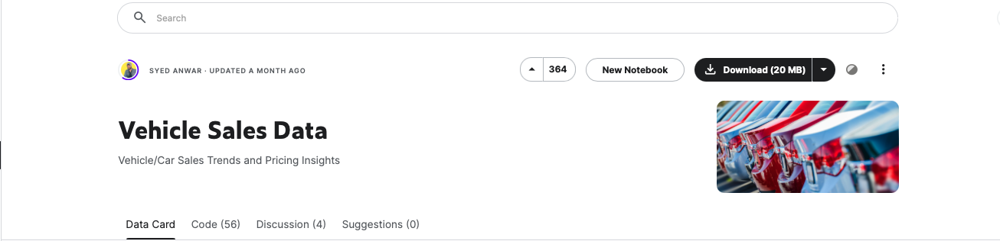

#### [Tableau](https://public.tableau.com/views/VehicleAnalysis-2/2?:language=zh-TW&publish=yes&:sid=&:display_count=n&:origin=viz_share_link)

#### [Data Source](https://www.kaggle.com/datasets/syedanwarafridi/vehicle-sales-data)

### Project Motivation:
My curiosity about vehicle sales sparked this project.

### Questions I Aim to Answer:

1. Which manufacturer has the highest sales?
2. What is the most popular car body type?
3. What is the best-selling car for each manufacturer?
4. Which car color is most popular among buyers?
5. For each manufacturer, which model sells the best?
6. Within each model, which trim level is the most popular?
7. Is it possible to use machine learning to predict a car's selling price?

